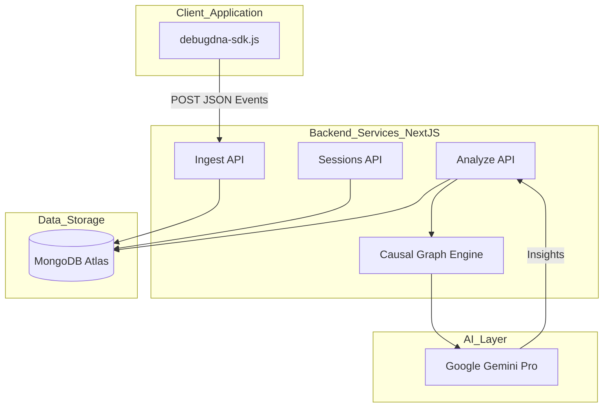
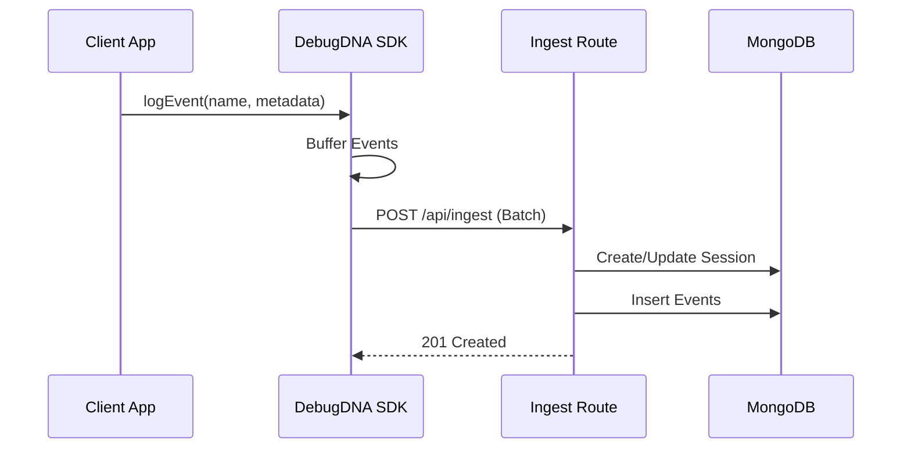
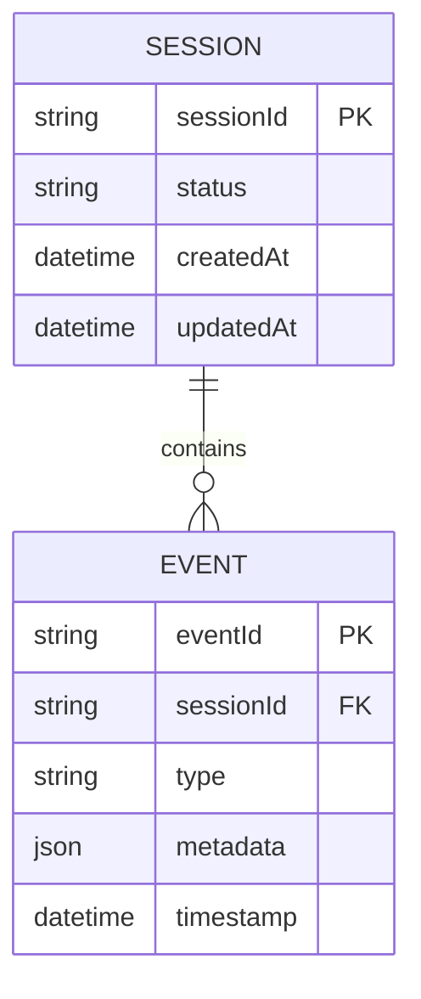

# debugDNA
### AI-Powered Causal Debugging and Event Tracing System


debugdna is a high-performance observability platform designed to capture, visualize, and analyze application events through AI-driven causal inference. By integrating a lightweight SDK, developers can transform raw logs into meaningful execution timelines and automated bug reports.

---

## Visual Diagrams

### System Architecture



### Data Flow Sequence



### Entity Relationship Diagram



---

## Problem Statement

Debugging modern web applications involves sifting through thousands of disconnected log lines across different layers of the stack. Traditional logging lacks context, making it difficult to understand the "Why" behind a failure. Developers spend roughly 50% of their time reproducing bugs rather than fixing them because the causal chain of events is often lost in high-traffic environments.

---

## Solution Overview

debugdna solves this by providing a unified ingestion layer that groups events into logical sessions. It uses a custom causal graph algorithm combined with Large Language Models (LLMs) to reconstruct the execution path. Instead of just seeing an error, developers see the sequence of user actions and system states that led to the crash, accompanied by AI-generated root cause analysis.

---

## Key Features

*   **Non-Intrusive SDK**: Minimal footprint JavaScript SDK for capturing frontend and backend events.
*   **Causal Graph Visualization**: Automatically links related events based on temporal proximity and metadata.
*   **AI Root Cause Analysis**: Leverages Google Gemini to interpret complex stack traces and event sequences.
*   **Live Dashboard**: Real-time session monitoring and event streaming.
*   **Interactive Timeline**: Visual representation of system state changes over time.
*   **Session Replay Metadata**: Context-rich debugging without the heavy overhead of video session recording.

---

## Tech Stack

| Category | Technology | Purpose |
| :--- | :--- | :--- |
| Frontend | Next.js 15 (App Router) | Core framework and dashboard UI |
| Styling | Tailwind CSS / Shadcn UI | Responsive and accessible interface components |
| Database | MongoDB | Scalable document storage for events and sessions |
| AI | Google Gemini API | Automated log analysis and causal inference |
| Language | TypeScript | Type-safe development across the stack |
| State Management | React Hooks | Local UI state and data fetching |

---

## Quick Start / Installation

### Prerequisites
*   Node.js 18.x or higher
*   MongoDB Instance (Local or Atlas)
*   Google Gemini API Key

### Repository Setup
```bash
# Clone the repository
git clone https://github.com/KunjGupta2006/debugdna.git
cd debugdna

# Install dependencies
npm install

# Run development server
npm run dev
```

### SDK Integration (Frontend)
```javascript
// Add the script to your HTML
<script src="https://your-domain.com/sdk/debugdna.min.js"></script>

// Initialize
debugdna.init({
  sessionId: 'user-session-123'
});

// Log an event
debugdna.track('button_click', { element: 'submit-btn' });
```

---

## Environment Variables

| Variable | Description | Example | Required |
| :--- | :--- | :--- | :--- |
| `MONGODB_URI` | Connection string for MongoDB | `mongodb+srv://...` | Yes |
| `GEMINI_API_KEY` | API Key for Google AI services | `AIzaSy...` | Yes |
| `NEXT_PUBLIC_APP_URL` | Base URL for the application | `http://localhost:3000` | No |

### Example .env
```text
MONGODB_URI=mongodb://localhost:27017/debugdna
GEMINI_API_KEY=your_gemini_key_here
```

---

## API Endpoints

| Method | Endpoint | Description | Auth |
| :--- | :--- | :--- | :--- |
| `POST` | `/api/ingest` | Send event data from SDK | API Key |
| `GET` | `/api/sessions` | Fetch list of all active sessions | JWT |
| `POST` | `/api/analyze` | Trigger AI analysis for a session | JWT |
| `GET` | `/api/sessions/[id]` | Get detailed event log for a session | JWT |

### Curl Example: Ingest Event
```bash
curl -X POST http://localhost:3000/api/ingest \
-H "Content-Type: application/json" \
-d '{
  "sessionId": "test-123",
  "events": [
    { "type": "click", "metadata": {"id": "login-btn"}, "timestamp": "2023-10-01T12:00:00Z" }
  ]
}'
```

---

## Project Structure

```text
debugdna/
├── app/                # Next.js App Router (Pages & API)
│   ├── api/            # Backend endpoints (Ingest, Analyze, Sessions)
│   ├── dashboard/      # Main monitoring interface
│   └── session/        # Individual session detail views
├── components/         # Shared UI components (Timeline, Cards)
│   └── ui/             # Radix UI primitives
├── sdk/                # Source for the JavaScript SDK
├── src/
│   ├── lib/            # Core logic (Gemini, Causal Graph, DB)
│   ├── models/         # Mongoose schemas (Event, Session)
│   └── types/          # TypeScript definitions
└── public/             # Static assets and compiled SDK
```

---

## Deployment & Architecture Decisions

*   **Hosting**: Vercel was chosen for deployment due to its seamless integration with Next.js and optimized Edge functions for the Ingest API.
*   **Database**: MongoDB was selected because event metadata is inherently polymorphic. A schema-less approach allows the SDK to capture diverse data types without requiring migrations.
*   **AI Integration**: Google Gemini was selected over OpenAI due to its competitive pricing for high-token volume log analysis and high rate limits for concurrent session processing.

---

## Technical Challenges & Solutions

### Challenge 1: Asynchronous Event Ordering
**Problem**: Network latency caused events sent from the SDK to arrive out of order, breaking the causal chain.
**Solution**: Implemented a client-side buffering mechanism in `debugdna-sdk.js` that assigns high-resolution timestamps before batching events. The `causalGraph.ts` utility then re-sorts and validates these sequences on the server before AI analysis.

### Challenge 2: Efficient Context Injection for LLMs
**Problem**: Passing entire session logs to Gemini was token-expensive and often included irrelevant data.
**Solution**: Created a pre-processing layer that filters "noisy" events (e.g., mouse moves) and summarizes state changes into a compact JSON format before hitting the Analyze API.

---

## Development Commands

*   `npm run dev`: Starts the development server with hot reloading.
*   `npm run build`: Optimizes the application for production.
*   `npm run lint`: Runs ESLint to check for code quality issues.
*   `npm test`: Reserved for future Vitest/Jest integration.

---

## Testing Approach

The project currently focuses on integration testing for the API layer:
*   **API Testing**: Manual verification using Postman and the included `demo` page.
*   **Schema Validation**: Strict Zod/Mongoose validation for incoming event payloads.
*   **Roadmap**: Implementation of Playwright for E2E testing of the dashboard and Vitest for the Causal Graph logic.

---

## Contributing Guidelines

Contributions are welcome. If you find a bug or have a feature request, please open an issue. To contribute code:
1. Fork the repository.
2. Create a feature branch.
3. Submit a Pull Request with a detailed description of your changes.
Let's make debugging less painful for everyone.

---

## License

This project is licensed under the MIT License.

---


--made by docify--
